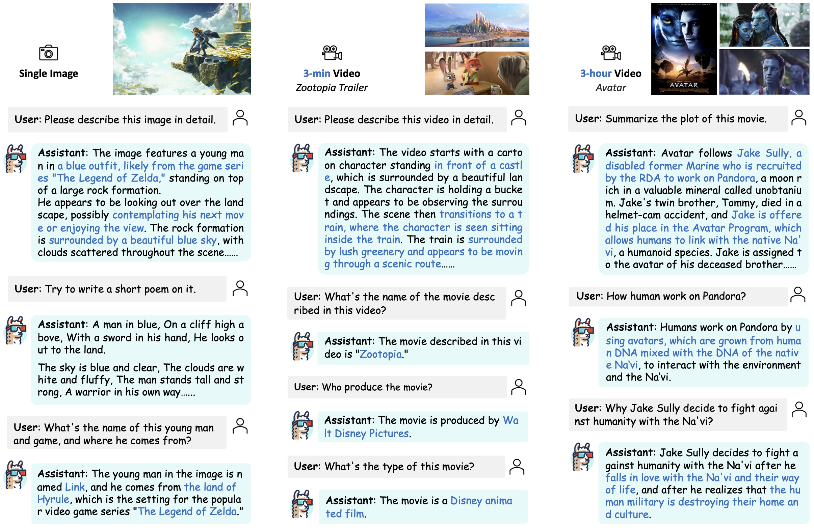
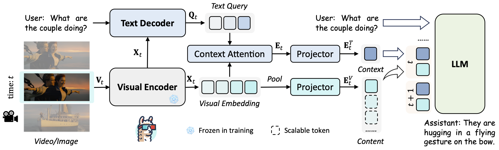

# LLaMA-VID: An Image is Worth 2 Tokens in Large Language Models

<a href='https://llama-vid.github.io/'></a>
<a href='https://llama-vid.github.io/'></a>
<a href=''></a>
<a href='https://huggingface.co/YanweiLi'></a>
<a href='https://huggingface.co/datasets/YanweiLi/LLaMA-VID-Data'></a>


LLaMA-VID empowers existing frameworks to support hour-long videos and pushes their upper limit with an extra context token. We build this repo based on LLaVA.

## Release
- [11/29] 🔥 LLaMA-VID is comming! We release the paper, code, data, models, and demo for LLaMA-VID. Welcome to check them out!

## Contents
- [Demo](#demo)
- [Install](#install)
- [Model](#model)
- [Preparation](#preparation)
- [Train](#train)
- [Evaluation](#evaluation)
- [TODO](#todo)
- [Citation](#citation)
- [Acknowledgement](#acknowledgement)
- [License](#license)

## Demo
We provide some selected examples in this section. More examples can be found in our [project page](https://llama-vid.github.io/). Feel free to try our online [demo](https://llama-vid.github.io/)!

<div align=center>

</div>

## Install
Please follow the instructions below to install the required packages.
1. Clone this repository
```bash
git clone https://github.com/dvlab-research/LLaMA-VID.git
```

2. Install Package
```bash
conda create -n llamavid python=3.10 -y
conda activate llamavid
cd 
pip install --upgrade pip  # enable PEP 660 support
pip install -e .
```

3. Install additional packages for training cases
```bash
pip install ninja
pip install flash-attn --no-build-isolation
```

## Model
LLaMA-VID simplely contains three prats: encoder and decoder are adopted to produce visual embedding and text-guided features, respectively; 
context token and content token are transformed with the tailored token generation strategy; 
instruction tuning is designed to unleash the potential of LLMs for image and video.

<div align=center>

</div>

We provide all our fully finetuned models on Stage 1 and 2 data (Long Video + Stage 3) for LLaMA-VID:

| Type | Image Size | Max Token | Base LLM | Vision Encoder | Finetuning Data | Finetuning schedule | Download |
|----------|----------|----------|----------|----------------|---------------|--------------------|------------------|
Image only | 224 | 4K | Vicuna-7B-v1.5 | EVA-G | LLaVA1.5-Instruct | full_ft-1e | [uploading]() |
Image only | 336 | 4K | Vicuna-7B-v1.5 | EVA-G | LLaVA1.5-Instruct | full_ft-1e | [uploading]() |
Image only | 336 | 4K | Vicuna-13B-v1.5 | EVA-G | LLaVA1.5-Instruct | full_ft-1e | [uploading]() |
Short video | 224 | 4K | Vicuna-7B-v1.5 | EVA-G | LLaVA1.5-VideoChatGPT-Instruct | full_ft-1e | [uploading]() |
Short video | 224 | 4K | Vicuna-13B-v1.5 | EVA-G | LLaVA1.5-VideoChatGPT-Instruct | full_ft-1e | [uploading]() |
Long video | 224 | 64K | Vicuna-13B-v1.5 | EVA-G | LLaVA1.5-VideoChatGPT-Instruct + LongVideoQA | full_ft-1e | [uploading]() |

Here are the pretrained weights (text decoder + context attention + projector) on Stage 1 data only:
| Type | Image Size | Max Token | Base LLM | Vision Encoder | Pretrain Data | Pretraining schedule | Download |
|----------|----------|----------|----------|----------------|---------------|----------------------|------------------|
Image only | 224 | 4K | Vicuna-7B-v1.5 | EVA-G | LCS-558K | 1e | [ckpt](https://huggingface.co/YanweiLi/llama-vid-7b-pretrain-224) |
Image only | 336 | 4K | Vicuna-7B-v1.5 | EVA-G | LCS-558K | 1e | [ckpt](https://huggingface.co/YanweiLi/llama-vid-7b-pretrain-336) |
Image only | 336 | 4K | Vicuna-13B-v1.5 | EVA-G | LCS-558K | 1e | [ckpt](https://huggingface.co/YanweiLi/llama-vid-13b-pretrain-336) |
Short video | 224 | 4K | Vicuna-7B-v1.5 | EVA-G | LCS-558K-WebVid-232K | 1e | [ckpt](https://huggingface.co/YanweiLi/llama-vid-7b-pretrain-224-video-fps-1) |
Short video | 224 | 4K | Vicuna-13B-v1.5 | EVA-G | LCS-558K-WebVid-232K | 1e | [ckpt](https://huggingface.co/YanweiLi/llama-vid-13b-pretrain-224-video-fps-1) |

## Preparation
### Dataset
We provide the processed image-based data for LLaMA-VID training. We organize the data in the format of LLaVA, please organize the training image-based data following [this](https://github.com/haotian-liu/LLaVA/blob/main/docs/Data.md) and evaluation image-based data following [this](https://github.com/haotian-liu/LLaVA/blob/main/docs/Evaluation.md).
Please put the pretrained data, finetuned data, and eval data in  `LLaMA-VID-Pretrain`, `LLaMA-VID-Finetune`, and `LLaMA-VID-Eval` subset following [Structure](#structure).

For video-based dataset, please download the 2.5M subset from [WebVid](https://maxbain.com/webvid-dataset/) and ActivityNet dataset from [official website](http://activity-net.org/download.html) or [video-chatgpt](https://github.com/mbzuai-oryx/Video-ChatGPT/blob/main/docs/train_video_chatgpt.md).
If you want to perform evaluation, please also download corresponding files from [here](https://github.com/mbzuai-oryx/Video-ChatGPT/blob/main/quantitative_evaluation/README.md).

For meta info, please down load the following files and organize them as in [Structure](#structure).

| Data file name | Size |
| --- | ---: |
| [blip_laion_cc_sbu_558k.json](https://huggingface.co/datasets/liuhaotian/LLaVA-Pretrain/blob/main/blip_laion_cc_sbu_558k.json) | 181M |
| [llava_v1_5_mix665k.json](https://huggingface.co/datasets/liuhaotian/LLaVA-Instruct-150K/blob/main/llava_v1_5_mix665k.json) | 1.03G |
| [llava_558k_with_webvid.json](https://huggingface.co/datasets/YanweiLi/LLaMA-VID-Data) | 254 MB |
| [llava_v1_5_mix665k_with_video_chatgpt.json](https://huggingface.co/datasets/YanweiLi/LLaMA-VID-Data) | 860 MB |
| [llava_v1_5_mix665k_with_video_chatgpt_maxtime_5min.json](https://huggingface.co/datasets/YanweiLi/LLaMA-VID-Data) | 860 MB |

### Pretrained Weights
We recommend users to download the pretrained weights from the following link [Vicuna-7b-v1.5](https://huggingface.co/lmsys/vicuna-7b-v1.5), [Vicuna-13b-v1.5](https://huggingface.co/lmsys/vicuna-13b-v1.5), [EVA-ViT-G](https://storage.googleapis.com/sfr-vision-language-research/LAVIS/models/BLIP2/eva_vit_g.pth), [QFormer-7b](https://storage.googleapis.com/sfr-vision-language-research/LAVIS/models/InstructBLIP/instruct_blip_vicuna7b_trimmed.pth), [QFormer-13b](https://storage.googleapis.com/sfr-vision-language-research/LAVIS/models/InstructBLIP/instruct_blip_vicuna13b_trimmed.pth) and put them in `model_zoo` following [Structure](#structure).


### Structure

The folder structure should be organized as follows before training.

```
LLaMA-VID
├── llamavid
├── scripts
├── work_dirs
│   ├── llama-vid
│   │   ├── llama-vid-13b-full-336
│   │   ├── ...
├── model_zoo
│   ├── LLM
│   │   ├── vicuna
│   │   │   ├── 7B-V1.5
│   │   │   ├── 13B-V1.5
│   ├── LAVIS
│   │   ├── eva_vit_g.pth
│   │   ├── instruct_blip_vicuna7b_trimmed.pth
│   │   ├── instruct_blip_vicuna13b_trimmed.pth
├── data
│   ├── LLaMA-VID-Pretrain
│   │   ├── blip_laion_cc_sbu_558k.json
│   │   ├── llava_558k_with_webvid.json
│   │   ├── images
│   │   ├── videos
│   ├── LLaMA-VID-Finetune
│   │   ├── llava_v1_5_mix665k.json
│   │   ├── llava_v1_5_mix665k_with_video_chatgpt.json
│   │   ├── llava_v1_5_mix665k_with_video_chatgpt_maxtime_5min.json
│   │   ├── activitynet
│   │   ├── coco
│   │   ├── gqa
│   │   ├── ocr_vqa
│   │   ├── textvqa
│   │   ├── vg
│   ├── LLaMA-VID-Eval
│   │   ├── gqa
│   │   ├── ...
```

## Train

LLaMA-VID training consists of three stages: (1) feature alignment stage: bridge the vision and language tokens; (2) instruction tuning stage: teach the model to follow multimodal instructions; (3) long video tuning stage: extend the position embedding and teach the model to follow hour-long video instructions.

LLaMA-VID is trained on 8 A100 GPUs with 80GB memory. To train on fewer GPUs, you can reduce the `per_device_train_batch_size` and increase the `gradient_accumulation_steps` accordingly. Always keep the global batch size the same: `per_device_train_batch_size` x `gradient_accumulation_steps` x `num_gpus`.

Please make sure you download and organize the data following [Preparation](#preparation) before training.

### Image Only

If you only want to train and finetune LLaMA-VID on image-based data, please run the following command for Vicuna-7B with image size 336:

```bash
bash scripts/image_only/train/stage_1_2_full_v7b_336.sh
```
or for Vicuna-13B with image size 336:
```bash
bash scripts/image_only/train/stage_1_2_full_v13b_336.sh
```
You can also try that with a smaller image size 224 and less visual tokens:
```bash
bash scripts/image_only/train/stage_1_2_full_v7b_224_grid_4.sh
```
Please find more training scripts in `scripts/image_only`.

### Short Video
If you are interested in training and finetuning LLaMA-VID on short video-based data, please run the following command for Vicuna-7B with image size 224:
```bash
bash scripts/video/stage_1_2_full_v7b_224_fps_1.sh
```
or for Vicuna-13B with image size 224:
```bash
bash scripts/video/stage_1_2_full_v13b_224_fps_1.sh
```
Please find more training scripts in `scripts/video`.


## Evaluation
We perform evaluation on both image-based and video-based benchmarks. Please download the evaluation data following [Preparation](#preparation) and organize them as in [Structure](#structure).

### Image Only
If you want to evaluate the model on image-based benchmarks, please use the scripts in `scripts/image_only/eval`. 
For example, run the following command for GQA evaluation:
```bash
bash scripts/image_only/eval/gqa.sh
```
Please find more evaluation scripts in `scripts/image_only/eval`.

### Video
If you want to evaluate the model on video-based benchmarks, please use the scripts in `scripts/video/eval`.
For example, run the following command for MSVD-QA evaluation:
```bash
bash scripts/video/eval/msvd_eval.sh
```
Please find more evaluation scripts in `scripts/video/eval`.

### CLI Inference
Chat with images and videos using LLaMA-VID without the need of Gradio interface. It also supports multiple GPUs, 4-bit and 8-bit quantized inference. With 4-bit quantization.
Please try this for image or video inference:

```bash
python -m llamavid.serve.cli \
    --model-path work_dirs/llama-vid/llama-vid-7b-full-336 \
    --image-file <path to your image>
```

or try this for video inference:
```bash
python -m llamavid.serve.cli \
    --model-path work_dirs/llama-vid/llama-vid-7b-full-224-video-fps-1 \
    --image-file <path to your video>
```

You can also try 4bit or 8bit for efficient inference 
```bash
python -m llamavid.serve.cli \
    --model-path work_dirs/llama-vid/llama-vid-7b-full-224-video-fps-1 \
    --image-file <path to your video>
    --load-4bit
```

## TODO
- [ ] Release all finetuned weights.
- [ ] Support hour-long video fintuning.
- [ ] Support gradio demo.

## Citation
If you find this repo useful for your research, please consider citing the paper
```
@article{li2023llamavid,
  title={LLaMA-VID: An Image is Worth 2 Tokens in Large Language Models},
  author={Li, Yanwei and Wang, Chengyao and Jia, Jiaya},
  journal={arXiv preprint },
  year={2023}
}
```

## Acknowledgement
We would like to thank the following repos for their great work:

- This work is built upon the [LLaVA](https://github.com/haotian-liu/LLaVA).
- This work utilizes LLMs from [Vicuna](https://github.com/lm-sys/FastChat).
- This work utilizes pretrained weights from [InstructBLIP](https://github.com/salesforce/LAVIS).
- We perform video-based evalution from [Video-ChatGPT](https://github.com/mbzuai-oryx/Video-ChatGPT).

## License
[](https://github.com/dvlab-research/LLaMA-VID/blob/main/LICENSE)
[](https://github.com/dvlab-research/LLaMA-VID/blob/main/DATA_LICENSE)
[](https://github.com/dvlab-research/LLaMA-VID/blob/main/WEIGHT_LICENSE)

The data and checkpoint is intended and licensed for research use only. They are also restricted to uses that follow the license agreement of LLaVA, LLaMA, Vicuna and GPT-4. The dataset is CC BY NC 4.0 (allowing only non-commercial use) and models trained using the dataset should not be used outside of research purposes.